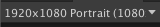
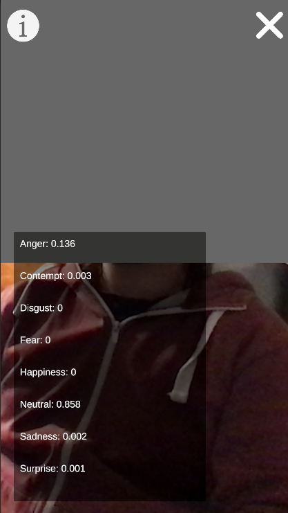
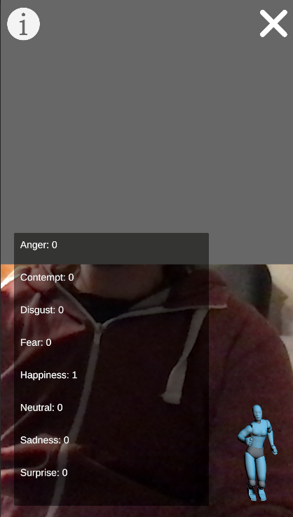
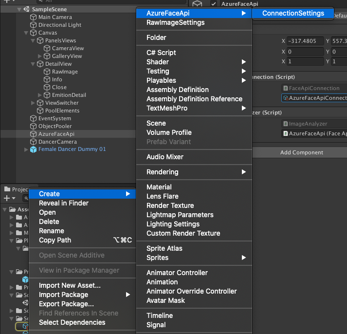
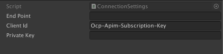
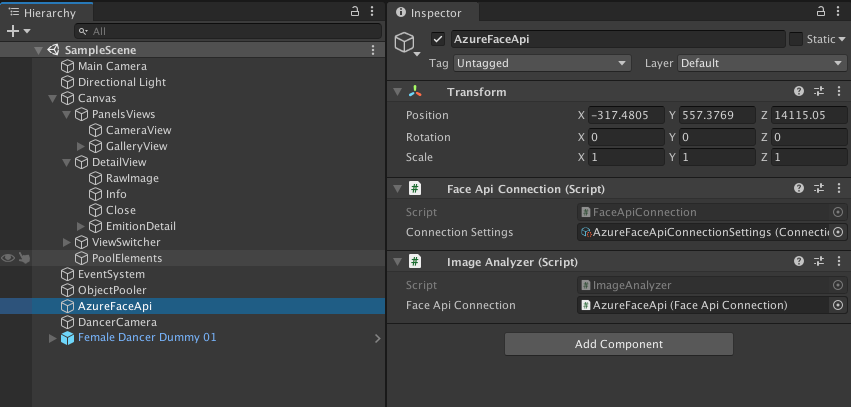

# Unity Azure Face API

## About application 
Simple app which use Azure Face Api to detect emotion on photo.

Application have really simple mobile layout so if you want test it in the editor I recomend setup your game view into resolution 1920x1080 portrait, dont use aspect ratio.

At this moment appication have 3 screens:
- Camera 
- Gallery 
- Detais

Gallery view at this moment is updated only on application start.

Photo is send to api when detail view is open, when te api return correct response info button in the top left corner will be interacitble.

After click in this button user can see more details about his emotions. 

More neutral            |  More Happy
:----------------------:|:-------------------------:
   |  

If the happines is the strongest emotion user will see little dancing guy in bottom right corner.

## Configuration with Azure

Before you started sending data to Azure Face API you need to create Face Api resource on you Azure Dashboard. After this you need `EndPoint` and `SecretKey`.

After this create in project new `ConnectionSettings`.

This is ScriptableObject when you should provide your `EndPoint` and `SecretKey`.

At last you need to put this asset into `FaceApiConnection` script on scene.

